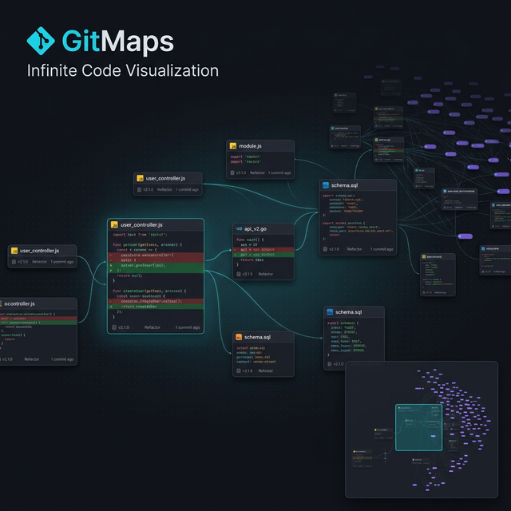

<p align="center">
  
</p>

<p align="center">
  
  
  
  
</p>

# 🪐 GitMaps

**Transcend the file tree.** GitMaps renders knowledge on an infinite canvas — with layers, time-travel, and a minimap to never lose context.

🌐 **Try it now:** [gitmaps.xyz](https://gitmaps.xyz) — no install required  
🔬 **Explore React:** [gitmaps.xyz/facebook/react](https://gitmaps.xyz/facebook/react)

---

## ✨ Features

| Feature | Description |
|---------|-------------|
| 🖼️ **Infinite Canvas** | Pan, zoom, drag files anywhere. Your layout is saved per-commit. |
| 📊 **Inline Diffs** | Green additions, red deletions — right inside each card. Scrollbar markers show *where* changes are. |
| ⏳ **Commit Timeline** | `←` `→` arrow keys through history. Each commit shows exactly which files changed. |
| 📌 **Persistent Layout** | Drag files where they belong in *your* mental model. Switch commits — arrangement stays. |
| 🔍 **Command Palette** | `Ctrl+K` to fuzzy-search files with subsequence-weighted scoring and character-level match highlighting. |
| 🌿 **Branch Comparison** | Side-by-side branch diff viewer with glassmorphism drawer, status badges, and diff cards rendered on canvas. |
| 📦 **Multi-Repo Workspace** | Load 2-3 repos side-by-side. Auto-offset with zone labels. Sidebar tabs switch commit timelines. |
| 👁️ **File Preview on Hover** | Glassmorphism tooltip at low zoom: language badge, path, first 12 lines of code. |
| 🐙 **GitHub Import** | Paste a URL for instant clone, or search by username with live repo filtering. |
| 🔗 **Connections** | `Alt+click` a line → pick target file → click target line. Visual bezier curves link related code. |
| 📁 **Layers** | Group files into focused subsets. Each layer remembers its own viewport position. |
| 🤖 **AI Chat** | Press `I` to open an AI sidebar that understands your current canvas context. |
| ⌨️ **VIM-style Diff Nav** | `j`/`k` to jump between changes across files, `Shift+J`/`K` for file-level navigation. |
| 🔎 **Cross-Card Search** | Press `/` to search across all visible file cards. Results highlighted in-place with match counts. |
| ✏️ **Full Editor** | CodeMirror 6 with syntax highlighting, multi-tab, auto-save, git commit, and code minimap. |
| ⇄ **Tab Diff** | Compare two open tabs side-by-side with LCS diff, change markers, synced scrolling. |
| 🧭 **Symbol Outline** | Side panel showing all functions/classes/types in a file. Click to scroll. |
| 🗺️ **Minimap** | Bird's-eye overview with click-to-navigate and viewport indicator. |
| 📝 **PR Review** | Comment threads on any line, stored in localStorage. |
| 📁 **Card Grouping** | Collapse entire directories into compact summary cards to reduce clutter. |

## 🚀 Quick Start

```sh
# One-liner (requires Bun)
npx gitmaps
# → http://localhost:3335
```

Or clone for development:

```sh
git clone https://github.com/7flash/gitmaps.git
cd galaxy-canvas
bun install
bun run dev
```

Open a repository by entering its path in the sidebar dropdown, or navigate directly:

```
http://localhost:3335/#/path/to/your/repo
```

Or import from GitHub — click the GitHub icon, paste a repo URL, and it clones + opens instantly.

## 🖥️ Keyboard Shortcuts

| Key | Action |
|-----|--------|
| `←` `→` | Previous / next commit |
| `Ctrl+K` | Command palette — fuzzy file search |
| `/` or `Ctrl+F` | Cross-card text search |
| `j` / `k` | Next / previous diff hunk (VIM-style) |
| `Shift+J` / `Shift+K` | Next / previous changed file |
| `W` | Fit selected cards to screen |
| `H` | Arrange selected in a row |
| `V` | Arrange selected in a column |
| `G` | Arrange selected in a grid |
| `Ctrl+A` | Select all cards |
| `Del` / `Backspace` | Hide selected files |
| `Space+Drag` | Pan canvas |
| `Scroll` | Zoom in/out |
| `Ctrl+`/`Ctrl-` | Increase/decrease card font size |
| `I` | Toggle AI chat sidebar |
| `Alt+Click` | Start connection from clicked line |
| `Esc` | Cancel / deselect all |
| Double-click | Zoom to file |

## 📦 Multi-Repo Workspace

Load multiple repositories on the same canvas:

1. Open any repo normally
2. Use the sidebar dropdown to load a second repo
3. Repos appear side-by-side with **zone labels** (color-coded floating badges)
4. **Sidebar tabs** switch commit timelines between repos
5. Each repo auto-offsets horizontally with an 800px gap

## 🔗 Connections

Draw visual links between related code across files:

1. **Alt+click** a line number in any file card (source)
2. A **file picker** appears — search and select the target file
3. **Click a line** in the target file to complete the connection

Connection markers appear as colored dots on the left side of each card. Click a marker to jump to the other end.

## 📁 Layers

Layers let you isolate subsets of files for focused review:

- **Create**: Click `+ New Layer` in the bottom bar
- **Add files**: Right-click a card → "Add to Layer"  
- **Switch**: Click any layer tab — canvas shows only that layer's files
- **Default**: "All Files" layer shows everything

Each layer remembers its own viewport position, so switching layers is instant context-switching.

## 🎮 GalaxyDraw Engine

The canvas is powered by **GalaxyDraw** — a zero-dependency infinite 2D canvas engine built for this project:

| Capability | Implementation |
|-----------|----------------|
| **Viewport culling** | Only creates DOM for visible cards. React repo (6833 files): 9 DOM nodes, 6824 deferred. ~35ms vs 14s. |
| **Zoom LOD** | Below 25%, cards render as lightweight pills with vertical file names. Smooth fade transitions. |
| **Throttled materialization** | Max 8 cards per frame with 150ms cooldown — no frame drops. |
| **Dual control modes** | Simple (drag=pan, scroll=zoom) or Advanced (space+drag=pan, rect select). |
| **Touch support** | Single-finger pan + pinch-to-zoom on tablets. |
| **Minimap** | Shows all files including deferred cards. Click to navigate. |

GalaxyDraw is also used by [WARMAPS](https://warmaps.xyz) for its intelligence dashboard canvas.

## 🔒 Production Security

When deployed as a SaaS (`NODE_ENV=production`):

- Path traversal protection — only `git-canvas/repos/` and `.data/uploads/` are accessible
- Folder browser endpoint completely blocked
- All 7 repo API routes validate paths via `validateRepoPath()`

## ⚙️ Stack

| Component | Technology |
|-----------|------------|
| Runtime | [Bun](https://bun.sh) |
| Framework | [Melina](https://github.com/7flash/melina.js) v2.5 (file-based routing, SSR, hot reload) |
| State | [XState](https://statemachine.xyz) v5 |
| Database | [sqlite-zod-orm](https://github.com/7flash/measure-fn) (positions, connections, layers) |
| Git | [simple-git](https://github.com/steveukx/git-js) |
| Profiling | [measure-fn](https://github.com/7flash/measure-fn) |

## License

ISC
