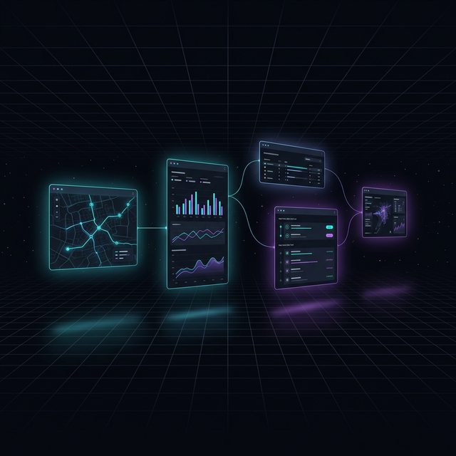

<p align="center">
  
</p>

<p align="center">
  <b>Infinite canvas framework for spatial applications. Zero dependencies, ~31KB.</b>
</p>

<p align="center">
  <a href="https://7flash.github.io/gitmaps/"></a>
  <a href="https://www.npmjs.com/package/galaxydraw"></a>
  <a href="https://www.npmjs.com/package/galaxydraw"></a>
  <a href="LICENSE"></a>
</p>

---

**Before** — 760 lines of custom pan/zoom/drag/touch/minimap/resize code per project:

```ts
let state = { zoom: 1, offsetX: 0, offsetY: 0 };
viewport.addEventListener('wheel', (e) => {
    e.preventDefault();
    const zoomFactor = e.deltaY < 0 ? 1.08 : 1 / 1.08;
    const newZoom = Math.max(0.15, Math.min(3, state.zoom * zoomFactor));
    const rect = viewport.getBoundingClientRect();
    const mouseX = e.clientX - rect.left;
    const mouseY = e.clientY - rect.top;
    const worldX = (mouseX - state.offsetX) / state.zoom;
    const worldY = (mouseY - state.offsetY) / state.zoom;
    state.zoom = newZoom;
    state.offsetX = mouseX - worldX * newZoom;
    state.offsetY = mouseY - worldY * newZoom;
    content.style.transform = `translate(${state.offsetX}px,${state.offsetY}px) scale(${state.zoom})`;
});
// + 700 more lines for mouse pan, touch, drag, resize, minimap, z-order...
```

**After** — galaxydraw handles all of it:

```ts
import { GalaxyDraw } from 'galaxydraw';

const gd = new GalaxyDraw(document.getElementById('app'), { mode: 'simple' });
// → Pan, zoom, touch, keyboard shortcuts — all working.
// → Cards, viewport culling, minimap — opt-in via plugins.
```

## Installation

```sh
bun add galaxydraw
# or: npm install galaxydraw
```

For local development across repos, use a `file:` dependency:

```json
"galaxydraw": "file:../galaxy-canvas/packages/galaxydraw"
```

## ✨ What You Get

Every `new GalaxyDraw()` automatically:

- 🖱️ **Mouse pan/zoom** → wheel zoom toward cursor, click-drag pan
- 📱 **Touch support** → single-finger pan, pinch-to-zoom (native, no libraries)
- ⌨️ **Keyboard** → Space+drag pan (advanced mode), input element passthrough
- 🃏 **Card system** → drag, resize, z-order, selection via plugins
- 🔍 **Viewport culling** → only visible cards stay in DOM, deferred lazy-creation
- 🗺️ **Minimap** → optional overview with click-to-navigate
- 📐 **Layout persistence** → save/restore positions (localStorage or custom)
- 🎛️ **Dual control modes** → Simple (dashboard-style) or Advanced (design-tool-style)
- 🔌 **Plugin architecture** → custom card types with event passthrough

## ⚙️ Constructor Options

```ts
const gd = new GalaxyDraw(containerEl, {
    mode: 'simple',     // or 'advanced'
    minimap: true,       // render overview panel
    cullMargin: 200,     // px beyond viewport to keep cards alive
    className: 'my-canvas', // custom CSS class on root
    cards: {
        defaultWidth: 400,
        defaultHeight: 300,
        minWidth: 200,
        minHeight: 150,
        gridSize: 20,    // snap-to-grid resolution (0 = off)
        cornerSize: 40,  // resize handle hit area
    },
});
```

| Option | Type | Default | Description |
|--------|------|---------|-------------|
| `mode` | `'simple' \| 'advanced'` | `'simple'` | Control scheme |
| `minimap` | `boolean` | `false` | Render overview panel |
| `cullMargin` | `number` | `200` | Viewport buffer in px |
| `className` | `string` | — | Custom root CSS class |
| `cards.defaultWidth` | `number` | `400` | Initial card width |
| `cards.defaultHeight` | `number` | `300` | Initial card height |
| `cards.minWidth` | `number` | `200` | Minimum resize width |
| `cards.minHeight` | `number` | `150` | Minimum resize height |
| `cards.gridSize` | `number` | `0` | Shift+drag snap grid (0 = off) |
| `cards.cornerSize` | `number` | `40` | Resize handle hit area |

## 🎛️ Control Modes

| Mode | Left-click on canvas | Left-click on card | Space+drag |
|------|---------------------|--------------------|------------|
| `simple` | Pan | — | Pan |
| `advanced` | — | Select | Pan |

```ts
gd.setMode('advanced');
console.log(gd.getMode()); // → 'advanced'
```

## 🔌 Card Plugins

Cards are rendered by plugins. Each plugin handles one card type:

```ts
import { GalaxyDraw } from 'galaxydraw';
import type { CardPlugin, CardData } from 'galaxydraw';

const widgetPlugin: CardPlugin = {
    type: 'widget',

    render(data: CardData): HTMLElement {
        const el = document.createElement('div');
        el.innerHTML = `
            <div class="gd-card-header">${data.meta?.title || 'Widget'}</div>
            <div class="gd-card-body">Content here</div>
        `;
        return el;
    },

    // Optional: claim mouse/wheel events for interactive content
    consumesWheel(target) {
        return !!target.closest('.maplibregl-map');
    },
    consumesMouse(target) {
        return !!target.closest('.maplibregl-map');
    },

    onResize(el, w, h) { /* handle resize */ },
    onDestroy(el) { /* cleanup */ },
};

const gd = new GalaxyDraw(containerEl, { mode: 'simple' });
gd.registerPlugin(widgetPlugin);
```

### CardPlugin Interface

| Method | Required | Description |
|--------|----------|-------------|
| `type` | Yes | Unique string identifier |
| `render(data)` | Yes | Returns the card's DOM element |
| `consumesWheel(target)` | No | Return `true` to let the card handle wheel events (e.g., maps) |
| `consumesMouse(target)` | No | Return `true` to let the card handle mouse events |
| `onResize(el, w, h)` | No | Called after card resize |
| `onDestroy(el)` | No | Cleanup callback |

### Creating Cards

```ts
// Immediate creation (visible cards)
const el = gd.cards.create('widget', {
    id: 'w1', x: 100, y: 100,
    meta: { title: 'Map' },
});
// → HTMLElement appended to canvas at (100, 100)

// Deferred creation (off-screen cards, lazy-materialized on scroll)
gd.cards.defer('widget', {
    id: 'w2', x: 3000, y: 3000, width: 400, height: 300,
    meta: { title: 'Far Away' },
});
// → Stored in memory, created when user scrolls near (3000, 3000)

// Remove
gd.cards.remove('w1');
// → Calls onDestroy, removes from DOM

// Clear all
gd.cards.clear();
```

## 📡 Event Bus

Subscribe to card and engine events:

```ts
gd.bus.on('card:move', ({ id, x, y }) => {
    console.log(`Card ${id} moved to (${x}, ${y})`);
    // → "Card w1 moved to (250, 180)"
});

gd.bus.on('card:resize', ({ id, width, height }) => {
    console.log(`Card ${id} resized: ${width}x${height}`);
    // → "Card w1 resized: 500x400"
});

gd.bus.on('card:select', ({ ids }) => {
    console.log(`Selected: ${ids.join(', ')}`);
    // → "Selected: w1, w2"
});

gd.bus.on('card:collapse', ({ id, collapsed }) => {
    console.log(`Card ${id} ${collapsed ? 'collapsed' : 'expanded'}`);
});

gd.bus.on('mode:change', ({ mode }) => {
    console.log(`Switched to ${mode} mode`);
});
```

| Event | Payload | When |
|-------|---------|------|
| `card:create` | `{ id, x, y }` | Card added to canvas |
| `card:move` | `{ id, x, y }` | Card drag ended |
| `card:resize` | `{ id, width, height }` | Card resize ended |
| `card:select` | `{ ids: string[] }` | Selection changed |
| `card:deselect` | `{ ids: string[] }` | Cards deselected |
| `card:collapse` | `{ id, collapsed }` | Collapse toggled |
| `card:remove` | `{ id }` | Card removed |
| `mode:change` | `{ mode }` | Control mode switched |

## 🧭 Canvas State

Direct access to pan/zoom state:

```ts
// Read current state
const { zoom, offsetX, offsetY } = gd.state.getSnapshot();
// → { zoom: 1.2, offsetX: -340, offsetY: -120 }

// Programmatic control
gd.state.set(1.5, -200, -100);       // set zoom, offsetX, offsetY
gd.state.zoomToward(400, 300, 1.2);  // zoom toward screen point
gd.state.pan(50, 0);                 // delta pan

// Subscribe to changes
const unsub = gd.state.subscribe(() => {
    console.log('Zoom:', gd.state.zoom); // → "Zoom: 1.5"
});

// Coordinate conversion
const worldPt = gd.state.screenToWorld(e.clientX, e.clientY);
// → { x: 842, y: 316 }

// Fit all content into view
gd.fitAll(60); // 60px padding
```

## 🏗️ Architecture

```
src/
├── index.ts           # Package entry — re-exports everything
└── core/
    ├── engine.ts      # GalaxyDraw class (337 lines)
    ├── state.ts       # CanvasState — zoom/offset/transform
    ├── cards.ts       # CardManager — create/defer/drag/resize/z-order
    ├── viewport.ts    # ViewportCuller — show/hide by visibility
    ├── events.ts      # EventBus — typed pub/sub
    ├── layout.ts      # LayoutManager — save/restore positions
    └── minimap.ts     # Minimap — overview with click navigation
```

Total: ~1,200 lines of engine code. Zero dependencies.

## 🚀 Used By

- **[GitMaps](https://github.com/7flash/gitmaps)** — Repository visualization on an infinite canvas. Uses `advanced` mode with FileCardPlugin + DiffCardPlugin. Renders 6,800+ file cards with viewport culling (~35ms).
- **[WARMAPS](https://github.com/7flash/starwar)** — Real-time geopolitical intelligence dashboard. Uses `simple` mode with WarmapsContainerPlugin for MapLibre/WebSocket feed passthrough.

## 🧪 Testing

24 unit tests covering the core engine:

```sh
bun test
```

| Suite | Tests | Coverage |
|-------|-------|----------|
| CanvasState | 14 | zoom, pan, clamp, screenToWorld, subscribe, fitAll |
| EventBus | 10 | on/off, emit, multi-listener, wildcard, once |

## License

MIT
